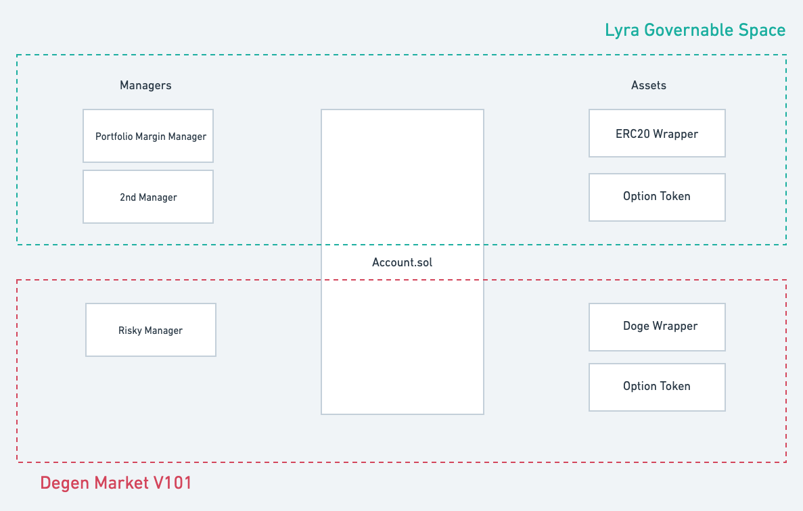
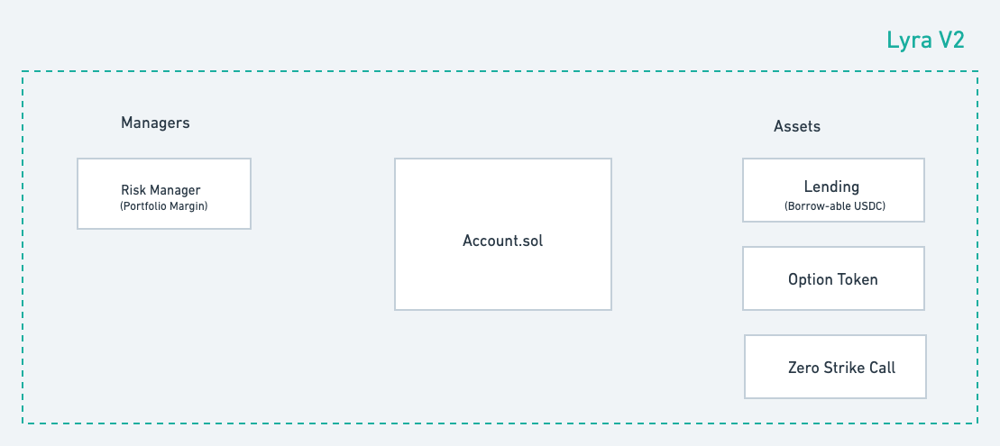

# Contract Overview

## Agenda

* [Base Layer](#the-base-layer)
  * [Account](#account)  
  * [Managers](#role-of-managers)
  * [Assets](#role-of-assets)
  * [Privileges](#privileges)
  * [Transfer Hooks](#hooks)

* AMMs
  * Future AMM
  * VGVV

## The Base layer

There are three big parts that compose of the **base layer**: `Account`, `Managers` and `Assets`

### Account

An `Account` is a fully-permissionless contract that allows anyone to create an account entity (represent as ERC721). That stored a lists of `{Asset, balance}`.

What we want to achieve with `Account` is the flexibility to enable different **Managers** to create rules about account validation, and allow direct transfer of any values (positive or negative) among accounts. The balances of assets can be either positive or negative.

For example: if Alice wants to long 1 call and Bob wants to short 1 call, they no longer need to "deposit and create an option token", they just submit a transfer and change the each account's balance from [0, 0] to [1, -1].

The two main missions of `Account` is to:

* validate if `msg.sender` is authorized to change (increase or decrease) one account's balance.
* inform all relevent parties about the trade. this can be separated into:
  * invoke the **manager** to validate the final state of the account
  * invoke the **asset** to validate the transfer and determine the ending balance.
  
### Role of **Managers**

A manager should be used to govern a set of accouts, and has the of previllege that can affect **all accounts** it controlls.

Two main jobs for an manager is to validate accounts, and keep them healthy.

#### 1. Account state validation

After a transaction is executed on an account, the manager will take a look at the final state and decide if this account is valid. For example, a transaction that leaves an account holding only -1000 USDC should be denied. But if the account has another 10 ETH in it, it's probably okay. 

#### 2. Debt Management

It is also the manager's obligation to determine "dangerous accounts" that might leave the system in debt and take care of liquidations.

#### 3. Settlement

(to be added)

### Role of **Assets**

The job of an **Asset** contract is to determine the result of a transfer, and maybe manage cash in and cash out to "account".

Some example:

* a `WETHWrapper` **asset** can take a user's weth and update the balance of the user's in `Account`. Someone can also reduce its balance in `Account` and cash out the real token. It can also denied transfer that would make any balance negative.

* an `OptionTOken` **asset** doesn't really let you deposit or withdraw, and it allows balance to go positive and negative. It only block transfers after expiry and help determine the value of a token at settlement.

### Privileges

The `Manager` and `Asset` contracts both have some privileges when it comes to updating `Accounts`.

To allow handling settlement and liquidation, the manager has the privileges to update **any asset balance** of any account under its control.

On the other hand, the asset has the privileges to update its own "asset balance" of any account. This is to support adding assets like weth or USDC into the system.

#### Shared Risk 

Managers and assets each have privillge that if use malicously could affect other's solvency: 

* a bad manager can singel handed increase its own balance on stable asset and cash out
* a bad asset can single handed increase its balance and trick the manager into believing it has enough collateral.

This mean that a sets of accounts and assets will form a "trusted group" that shares the risk among all components. If any of the contract is compromised or hacked, the whole "circle" goes involvent together.

As a result, the manager should revert all transfer that include a "unknown asset" into an account; and an asset should revert all transfer request from a account controlled by "unknown manager"

While the account contract is totally permissionless, anyone can spin up their own "ecosystem" with risk totally separated from the rest of the world.

### Hooks

To achieve the "checks" mentioned above, whenever a trade happens, the account pass the transfer information to the **Asset** contract through **asset hook** to make sure the final balance of an account is valid and the account is controlled by a good manager, and at the end of all **transfers**, it triggers the **manager hook** to let the manager determine the final state of an account.

## Lyra V2

The Lyra v2 refers to 1 manager and 3 assets we will be built, along with 2 AMMs outside of the base layer.

## AMM