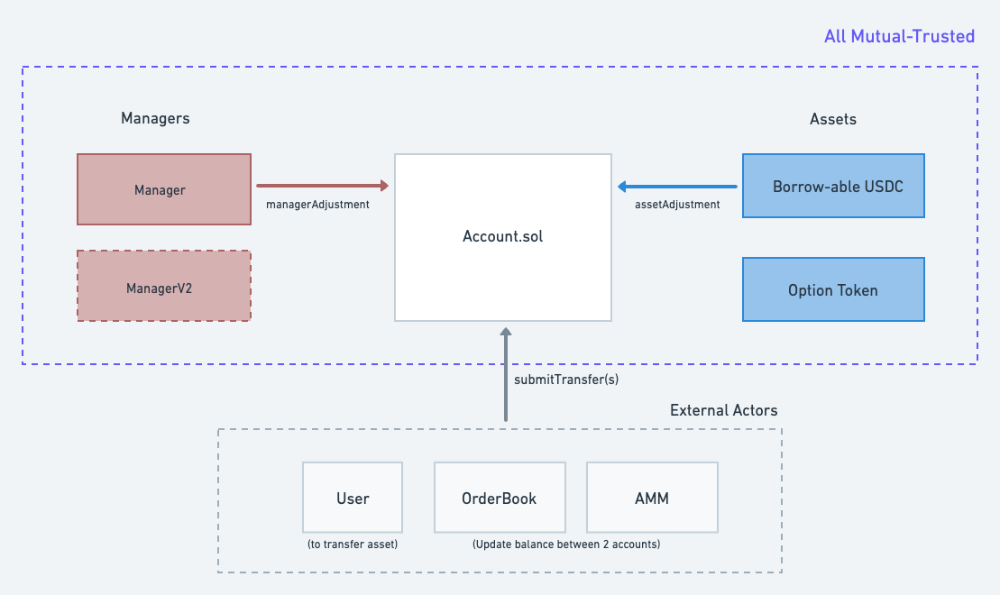
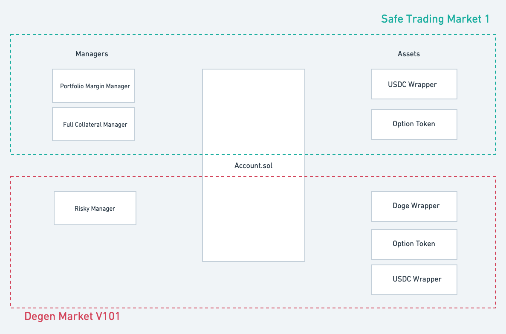

# Contract Overview

## Agenda

* [Base Layer Overview](#the-base-layer)
  * [Accounts](#accounts)  
  * [Managers](#managers)
  * [Assets](#assets)
  * [Shared Risk and Hooks](#shared-risk)
* [What is Lyra V2](#lyra-v2)
* [AMMs](#amms)
  * Future AMM
  * VGVV

## The Base layer

There are three big parts that compose of the **base layer**: `Account`, `Managers` and `Assets`.

### Accounts

`Accounts` is a fully permission-less contract that allows anyone to create an account entity (represent as ERC721), which stores a list of `{asset, subId, balance}` for a user. Each `asset` can have multiple `subIds` that represent asset sub categories (e.g. asset->option, subId->Jan 1st, $1000 Strike, ETH Call). 

The primary goal of `Accounts` is to give different **Managers** and **Assets** the flexibility to create unique validation rules for various account actions.

The two main missions of `Accounts` are:

* validate if `msg.sender` is authorized to change (increase or decrease) one account's balance.
* inform all relevant parties about the trade. This includes:
  * manager hook: invoke the **manager** to validate the final state of the account
  * asset hook: invoke the **asset** to validate the transfer and determine the ending balance.

Additionally, balances of assets can be either positive or negative. For example: if Alice wants to long 1 call and Bob wants to short 1 call, they no longer need to "deposit and create an option token in another contract". An approved party just submits a transfer and changes each account's balance from [0, 0] to [1, -1].

P.S. Go to [Accounts](./accounts) for some more detailed documentation about the approval system and the hooks.
  
### Managers

A manager should be used to govern a set of accounts, and has certain privileges. The 3x main jobs of a manager: 

* **Account state validation**: After a transaction is executed on an account, the manager will take a look at the final state of an account and decide if this account is valid. For example, a transaction that leaves an account holding only -1000 USDC should be denied. But if the account has another 10 ETH in it, it's probably okay.
* **Debt Management**: It is also the manager's obligation to determine "dangerous accounts" that might leave the system in debt and take care of liquidations.
* **Settlement**:  If an account has assets with expiry, the manager should also handle the settlement after expiry. For example, if an account long 1 2000-ETH-CALL-DEC01-2022 and it expired in the money, the manager has the right to increase the account's usdc balance, and burn the option balance at expiry.

#### Manager Privileges 

To allow handling settlement and liquidation, the manager has the privileges to update **any asset balance** of an account under its control.

### Assets

The job of an **Asset** contract is to determine the result of a transfer, and maybe manage deposit and withdraw.

Some example:

* a `WETHWrapper` **asset** can take a user's weth and update the user's balance in `Accounts`. Someone can also reduce their balance in `Accounts` and withdraw the real token. In the case of an "only-positive" asset, the asset can deny transfers that would make any balance negative.

* an `OptionToken` **asset** does not allow deposits or withdrawals but balances can be both positive and negative. The asset blocks transfers (1) after expiry (2) of invalid subIds. The asset can also help the manager determine the value of a token at settlement or during account state validation.

#### Asset Privileges

The asset has the privileges to update its own "asset balance" of any account. This is to support actions such as (a) deposits and withdrawals of underlying tokens (b) interest accrual.

We can see from the diagram that `Assets` and `Managers` can both access the account directly with `assetAdjustment` and `managerAdjustment`. Every other external party (including an AMM or orderbook) will need to get approvals from the account owner to act on their behalf.

### Shared Risk

Managers and assets each have privileges that, if used maliciously, could affect the other's solvency: 

* a bad manager can single handedly increase a balance of an account and cash out it's underlying token
* a bad asset can single handedly increase its balance and trick the manager into believing it has enough collateral.

This means that a set of connected managers and assets will form a "trusted group" inside which everyone shares the same solvency risks; If any of the contract is compromised or hacked, the whole "ecosystem" goes insolvent together. As a result, a manager should revert all transfers that adds a "unknown asset" into an account; and an asset should revert all transfers from or to a account controlled by "unknown manager".

#### Hooks

To check these requirements, whenever a trade happens, `Accounts` passes the transfer information to the **Asset** contract through the **asset hook** to make sure the final balance of an account is valid and the account is controlled by a good manager, and at the end of all **transfers**, it triggers the **manager hook** to let the manager determine the final state of an account.

It's worth mentioning that because the **account contract** is totally permission-less, anyone can spin up their own "ecosystem" with risk totally separated from other ecosystems.

## Lyra V2

The ultimate goal of Lyra v2 is to build a permission-less margin system for both traders and AMMs, with a modular framework for upgrading existing contracts and supplementing the Lyra ecosystem with new features. At the base layer, this will be composed of 2 manager and 3 assets at the launch of V2. You can find the more detailed documentation about each modules from the links below: 

* (Manager) [MLRM: Max Loss Risk Manager](./) 
* (Manager) [PCRM: Partially Collateralized Risk Manager](./) 
* (Asset) [Lending (Borrowable USD)](./)
* (Asset) [Option Token](./)
* (Asset) [Future Token](./)

There will also be 2 other AMMs being built:

* [Future AMM](./)
* [Option AMM](./)

## AMMs

(to be added)