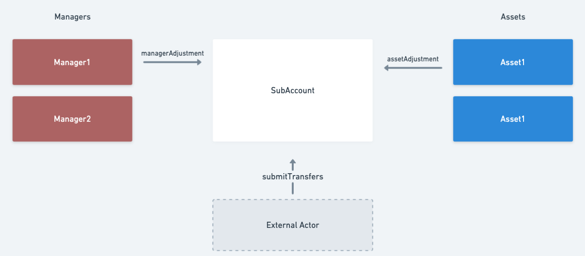
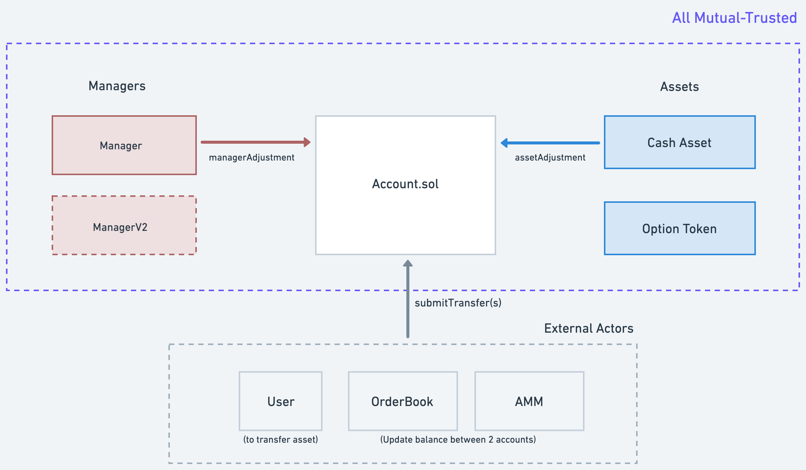
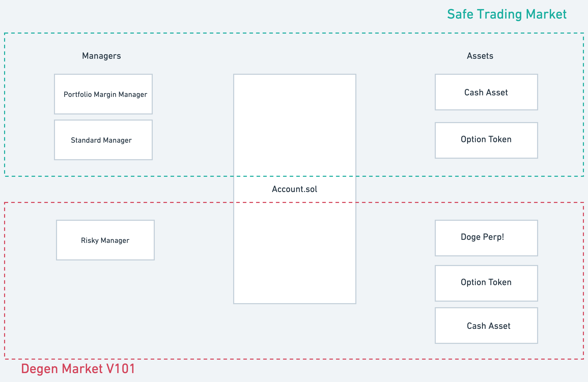

# Contract Overview

## Agenda

* [Base Layer Overview](#the-base-layer)
  * [Account](#account)  
  * [Managers](#managers)
  * [Assets](#assets)
  * [Shared Risk and Hooks](#shared-risk)
* [What is Lyra V2](#lyra-v2)
* [AMMs](#amms)
  * Future AMM
  * VGVV

## The Base layer

There are three big parts that compose of the **base layer**: `Account`, `Managers` and `Assets`.

### Account

An `Account` is a fully-permissionless contract that allows anyone to create an account entity (represent as ERC721), which stores a lists of `{Asset, balance}` for a user.

What we want to achieve with `Account` is the flexibility to enable different **Managers** to create rules about account validation, and allow direct transfer of any values (positive or negative) among accounts. The balances of assets can be either positive or negative.

For example: if Alice wants to long 1 call and Bob wants to short 1 call, they no longer need to "deposit and create an option token in another contract", they just submit a transfer and change the each account's balance from [0, 0] to [1, -1].

The two main missions of `Account` are:

* validate if `msg.sender` is authorized to change (increase or decrease) one account's balance.
* inform all relevant parties about the trade. This includes:
  * manager hook: invoke the **manager** to validate the final state of the account
  * asset hook: invoke the **asset** to validate the transfer and determine the ending balance.

P.S. Go to [Accounts](./account) for some more detailed documentation about the approval system and the hooks.
  
### Managers

A manager should be used to govern a set of accouts, and has certain previlleges. Three main jobs for an manager are: 

* **Account state validation**: After a transaction is executed on an account, the manager will take a look at the final state of an account and decide if this account is valid. For example, a transaction that leaves an account holding only -1000 USDC should be denied. But if the account has another 10 ETH in it, it's probably okay.
* **Debt Management**: It is also the manager's obligation to determine "dangerous accounts" that might leave the system in debt and take care of liquidations.
* **Settlement**:  If an account has assets with expiry, the manager should also handle the settlment after expiry. For example, if an account long 1 2000-ETH-CALL-DEC01-2022 and it expired in the money, the manager has the right to increase the account's usdc balance, and burn the option balance at expiry.

#### Manager Privileges 

To allow handling settlement and liquidation, the manager has the privileges to update **any asset balance** of an account under its control.

### Assets

The job of an **Asset** contract is to determine the result of a transfer, and maybe manage deposit and withdraw.

Some example:

* a `WETHWrapper` **asset** can take a user's weth and update the balance of the user's in `Account`. Someone can also reduce its balance in `Account` and withdraw the real token. It can also denies transfer that would make any balance negative.

* an `OptionTOken` **asset** doesn't really let you deposit or withdraw, and it allows balance to go positive and negative. It only blocks transfers after expiry and help determine the value of a token at settlement.

#### Asset Privileges

The asset has the privileges to update its own "asset balance" of any account. This is to support deposit and withdraw of assets.

We can see from the diagram that `Assets` and `Managers` can both access the account direclty with `assetAdjustment` and `mangerAdjustment`. Every other external parties (including AMM, orderbook) will need to get approvals from the account owner to act on their behalf.

### Shared Risk

Managers and assets each have privilege that if use malicously could affect other's solvency: 

* a bad manager can singel handed increase its own balance on stable asset and cash out
* a bad asset can single handed increase its balance and trick the manager into believing it has enough collateral.

This mean that a sets of accounts and assets will form a "trusted group" inside which everyone shares the same risk; If any of the contract is compromised or hacked, the whole "ecosystem" goes insolvent together.As a result, a manager should revert all transfers that adds a "unknown asset" into an account; and an asset should revert all transfers from or to a account controlled by "unknown manager".

#### Hooks

To check these requirements, whenever a trade happens, the account pass the transfer information to the **Asset** contract through **asset hook** to make sure the final balance of an account is valid and the account is controlled by a good manager, and at the end of all **transfers**, it triggers the **manager hook** to let the manager determine the final state of an account.

It's worth mentioning that because the **account contract** is totally permissionless, anyone can spin up their own "ecosystem" with risk totally separated from other eco systems.

## Lyra V2

The ultimate goal of Lyra v2 is to build a super capital efficient margin system, which can be used for traders and a new option AMM. At the base layser, this will be composed of 1 manager and 3 assets. You can find the more detailed documentation about each modules from the links below: 

* (Manager) [Portfolio Margning Risk Manager](./) 
* (Asset) [Lending (Borrowable USD)](./)
* (Asset) [Option Token](./)
* (Asset) [Future Token](./)

There will also be 2 other AMMs being built:

* [Future AMM](./)
* [Option AMM](./)

## AMMs

(to be added)